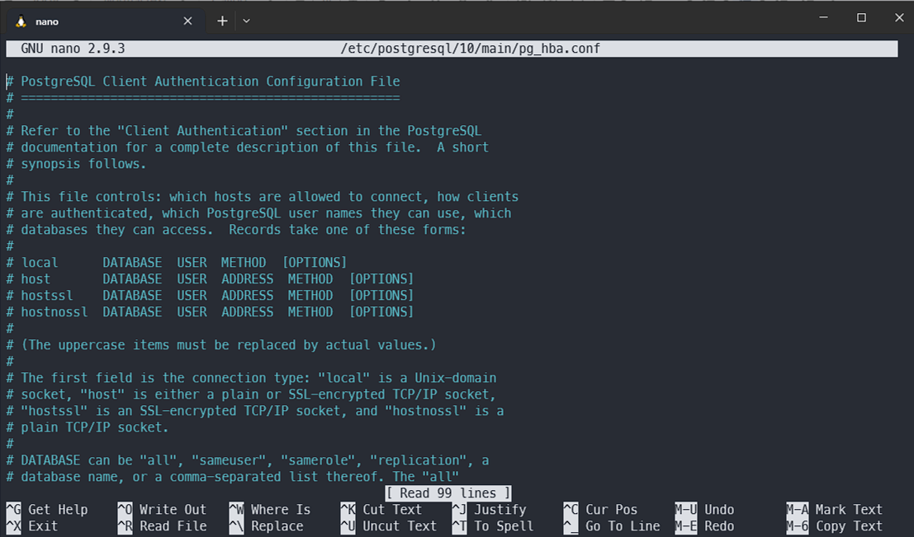

# Setting up WSL (Do this if you are using Windows)

1. Open Powershell as **Administrator**
2. Copy and paste then run the following 2 commands:

```
dism.exe /online /enable-feature /featurename:Microsoft-Windows-Subsystem-Linux /all /norestart
```

```
dism.exe /online /enable-feature /featurename:VirtualMachinePlatform /all /norestart
```

3. Install Ubuntu from Microsoft Store

```
wsl --installsh
```

```
wsl --install -d Ubuntu-20.04
```

4. Restart your computer
5. In Powershell (No need to be as Administrator), copy and paste then run the following command:

```
wsl --set-default-version 2
```

## Setting up Ubuntu

1. Open Start menu, search for your installed Ubuntu version and launch it. A window should pop up saying it's installing.z
2. Add your Ubuntu Username and Password there. The Username will dictate the home directory name and the password is the one that is asked for during sudo commands.
3. Run the following commands to update your ubuntu

```
sudo apt update && upgrade
```

## Adding a Shortcut to the Ubuntu files

Being a part of Windows, WSL can access your Windows files, but we're only concerned with using the Ubuntu file system and not the Windows one.

So to make it easy, if you want to copy files to the Ubuntu side, a shortcut to that specific folder is needed.

1. Right click on your desktop
2. Click on "New"
3. Click on "Shortcut"
4. It will as for a file path, type in \\wsl$\<Ubuntu>\home\<username>\ where the <Ubuntu> is whatever distro is installed (If "Ubuntu 20.04 LTS" was installed it would be Ubuntu-20.04 etc.)
5. Add a name for the shortcut
6. To make it easier to navigate your wsl folder, right click on the folder and Pin it to Quick Access

If there are any files that need to be placed in the Ubuntu file system, then you should paste it in this directory. NOTE: When copy a from the Windows file system to here, it will create a hidden file with the filename: <filename>.ZoneIdentifier or something similar. They are safe to delete.

# Add SSH key to Github (if not already added)

Purpose: To allow you to push to Github without having to enter your password every time.

1. Generate SSH key
    ```
    ssh-keygen -t ed25519 -C "your_email@example.com"
    ```
2. View SSH key (copy the output)
    ```
    cat ~/.ssh/id_ed25519.pub
    ```
3. Add SSH key to Github
    - Go to Github settings
    - Click on SSH and GPG keys
    - Click on New SSH key
    - Paste your SSH key into the text box
    - Click Add SSH key
4. Test SSH connection
    ```
    ssh -T git@github.com
    ```


# Setup Guide

1. Clone this repository
    ```
    git clone git@github.com:cup-noodlehS/haircat-backend.git
    ```

2. Navigate to project directory
    ```
    cd haircat-backend
    ```

3. Install Python 3.10
    ```
    sudo apt update
    sudo apt install software-properties-common
    sudo add-apt-repository ppa:deadsnakes/ppa
    sudo apt install python3.10
    ```

4. Verify Python installation
    ```
    python3.10 --version
    ```

5. Install and setup virtualenv
    ```
    python3.10 -m pip install virtualenv
    python3.10 -m virtualenv venv
    ```

6. Activate virtual environment
    ```
    source venv/bin/activate
    ```
    

6. Install dependecies `pip install -r requirements.txt`
7. Setup postgresql
    - install
        ```
        sudo apt-get update
        sudo apt-get install postgresql postgresql-contrib
        sudo service postgresql start
        ```
    - Create user
        ```
        sudo -u postgres createuser --login --pwprompt haircatuser
        ```
        set password to `password`
    - Create database
        ```
        sudo -i -u postgres
        psql
        CREATE DATABASE haircat
        ```
    - Leave the postgres shell via CTRL + D two times
    - Update PostgresQL permissions of Peer Authentication (PostgresQL version depends on the version of Ubuntu you currently have. You can press the `TAB` key to auto-complete if you don't know your PostgresQL version)
        ```
        sudo nano /etc/postgresql/<postgres version>/main/pg_hba.conf
        ```
    - Your terminal should look like this:
      
    - Scroll down to the bottom-most part by using the arrow keys and update all the word “peer” into “trust”. CTRL + X to exit
    - restart postgresql
        ```
        sudo service postgresql restart
        ```
8. Run migrations `python src/manage.py migrate`

## Running the server

1. Activate virtual environment (once per session)
    ```
    source venv/bin/activate
    ```
    > to deactivate, run `deactivate`
2. Run server
    ```
    python src/manage.py runserver
    ```


<p align="right">Last updated by <a href="https://github.com/cup-noodlehS"><b>Sheldon Arthur</b></a></p>
